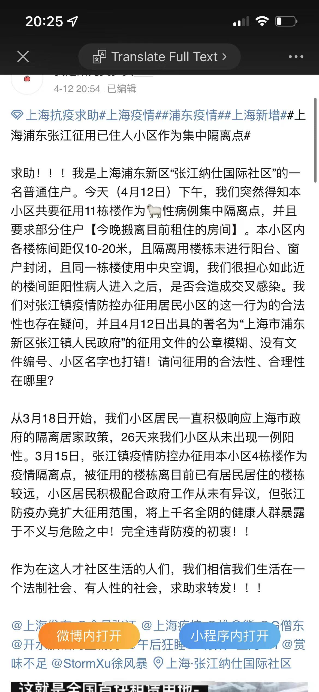

# Shanghai_Dairy
May the truth be buried beneath the glacier, remembered by only few.

## About 
Everyday shit happens in this city and I just wanna write down the shit I have been seeing from internet. I will put what I see duing this fucking covid lockdown into each individual folder sorted by date, add comments, add sources and add my personal rating of credibility 

## 关于
最近上海狗屎事情太多了我准备在这个repo下面把我看到的新闻都下来防止以后和谐。我会加上信息的source 和我自己认为的可信度 out of 10

### 4.16
71岁陈顺平因为胰腺炎在凌晨无医院接诊，疼痛难忍，早晨在家坠楼身亡
Shunping Chen, age 71, suffered Pancreatitis over a night and got no hospitalization, fell from his apartment the next morning
可信度 8/10

 \
 \
 \
 \

### 4.14
张江纳仕社区强制征用住户小区作为集中隔离点
Several apartments in Nashi, a community in Zhangjiang area, was taken as a centralized hospitalization for those tested covid-positive; some residents had to move from one apartment to another as their own were taken 
可信度 9/10

 \

https://user-images.githubusercontent.com/36904550/163398440-67d14155-85e8-467c-935f-12ef77c5787b.mp4

